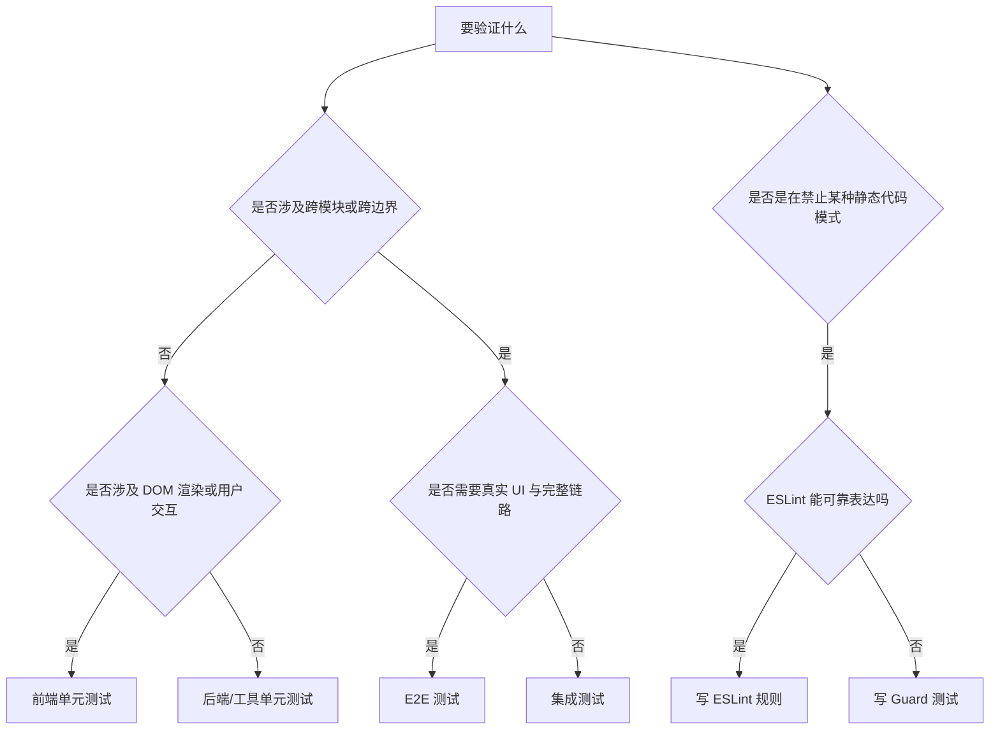

# 测试类型决策指南

## 先问“我要证明什么”

不要从工具出发，而要从待证明的行为出发：

- 是单个函数或单个 store 的状态转移？
- 是跨模块协作？
- 是 UI 的真实交互？
- 是代码风格与静态约束？
- 是跨边界契约稳定性？

## 决策树

## 选择规则

### 单元测试

适用场景：

- 单个函数、单个 service、单个 store、单个 hook 的确定性行为。
- 无需真实 Electron、真实数据库、真实浏览器即可验证。

不适用场景：

- 需要证明多个模块之间的协作顺序。
- 需要证明完整的渲染交互或端到端链路。

典型位置：

- `apps/desktop/renderer/src/**/*.test.tsx`
- `apps/desktop/main/src/**/*.test.ts`
- `apps/desktop/tests/unit/`

### 集成测试

适用场景：

- 两个或多个模块协同工作时的行为。
- 需要使用内存 SQLite、fake server、mock IPC，但仍不依赖真实 Electron UI。

不适用场景：

- 只是测单个纯函数。
- 只是想验证一个静态约束。

典型位置：

- `apps/desktop/tests/integration/`

### E2E 测试

适用场景：

- 关键用户路径：打开应用、命令面板、编辑、保存、AI 成功/失败/取消、导出、设置。
- 需要证明“从用户点击到最终结果”整条链路都成立。

不适用场景：

- 单个按钮样式或小型状态逻辑。
- 可以更快、更稳定地在集成层证明的行为。

典型位置：

- `apps/desktop/tests/e2e/`

### Guard 测试

适用场景：

- ESLint 不能可靠表达的跨文件、跨层、一致性约束。
- 例如：IPC 契约映射、原生绑定路径、某类跨目录配对关系。

不适用场景：

- i18n 裸字符串、import 规则、简单命名规则，这类通常更适合 ESLint。

典型位置：

- `apps/desktop/tests/lint/`
- 个别 `*.guard.test.ts`

### Contract 测试

适用场景：

- IPC request/response 结构、错误码、schema-first 生成结果、跨边界 envelope。
- 目标是证明“边界不变性”，而不是内部实现细节。

不适用场景：

- 单个 service 内部的小逻辑。

### Perf / Benchmark / Acceptance

适用场景：

- 存在明确 SLO、门禁或预算，例如 IPC latency、coverage gate、discovery consistency。
- 目标是验证“是否达到阈值”，而不是功能本身是否存在。

不适用场景：

- 普通业务逻辑正确性。

## 一张速查表

| 我想证明什么                          | 应优先选择               |
| ------------------------------------- | ------------------------ |
| 一个 store 的状态转移                 | 单元测试                 |
| 一个组件的点击、输入、可见文案        | 前端单元测试             |
| 一个 IPC handler 的 schema + 错误返回 | 后端单元 / Contract 测试 |
| SQLite / fake service / 多模块联动    | 集成测试                 |
| 用户从界面操作到最终结果的整条链路    | E2E                      |
| 跨文件约束，ESLint 写不清             | Guard                    |
| 代码风格、import、i18n、命名          | ESLint                   |

## 决策时的常见误区

- “写 E2E 最真实，所以都用 E2E”
  真实不等于高效。E2E 只守关键用户路径，不替代下层测试。

- “Guard 最快，直接扫文件”
  若 ESLint 能做，优先 ESLint；Guard 是补洞，不是捷径。

- “这个测试写起来麻烦，我就测调用次数”
  这通常意味着你在测实现，而不是测行为。

## 结论

先选最便宜、最稳定、最能表达行为的一层；只有在这一层无法证明需求时，才往上走一层。测试层级不是地位高低，而是证据成本的不同。
